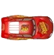

# Robot Navigation Simulator

A computational simulation framework for autonomous robot navigation, pathfinding, and environment mapping implemented in Python using the Pygame library. The system simulates intelligent navigation through complex environments by implementing multiple graph-based and heuristic pathfinding algorithms, utilizing raycast-based obstacle detection, and featuring an advanced dynamic mapping system.



## Technical Overview

### Pathfinding Algorithm Implementation

- **A* Algorithm**: 
  - Heuristic-based search algorithm with O(E) time complexity
  - Uses Manhattan distance heuristic for distance estimation
  - Implements priority queue with binary heap for frontier management
  - Balances completeness and optimality with performance

- **Dijkstra's Algorithm**: 
  - Uniform-cost graph search with O(V² + E) complexity
  - Guarantees optimal path discovery in weighted graphs
  - Utilizes priority queue for vertex selection
  - Implements early termination when target is reached

- **Grassfire/Wavefront Algorithm**: 
  - BFS-based flood-fill approach with O(V + E) complexity
  - Creates distance grid from goal node
  - Uses gradient descent for path reconstruction
  - Effective for maze-like environments

- **Obstacle Density Pathfinding**: 
  - Novel algorithm incorporating obstacle proximity weighting
  - Calculates density fields to quantify obstacle aggregation
  - Applies penalty factors to paths near obstacles
  - Creates paths that maintain safer clearance from walls

- **Sonar-Guided Vector Field Navigation**: 
  - Integrates 360° sensor data for directional planning
  - Constructs repulsion vectors from obstacle detections
  - Combines goal attraction with obstacle repulsion fields
  - Adaptively adjusts path based on real-time environmental sensing

### Perception and Sensing Systems

- **Raycasting Sonar Simulation**:
  - Implements angular ray projection with configurable resolution
  - Detection range dynamically adjustable (120px default with multiplier)
  - 16-ray discretization for 360° environmental scanning
  - Distance-based obstacle detection with vector-based interpretation

- **Sensor Data Processing**:
  - Maps detection points to polar coordinates (distance, angle)
  - Analyzes detection density for spatial awareness
  - Identifies open directional "slices" for avoidance planning
  - Temporal filtering to reduce sensor noise and false positives

### Reactive Navigation and Motion Control

- **Dynamic Obstacle Avoidance**:
  - Implements finite state machine for avoidance behaviors
  - Analyzes sensor data to determine optimal evasion vectors
  - Uses multi-stage avoidance maneuvers (backup and turn)
  - Path recomputation after avoidance completion
  
- **Stuck Detection and Recovery**:
  - Monitors positional delta to detect insufficient movement
  - Implements progressive recovery strategies
  - Tracks consecutive stuck incidents with escalating responses
  - Emergency maneuvers for persistent navigation failures

### Environment Mapping and Representation

- **Occupancy Grid Mapping**:
  - Generates binary obstacle map from visual input
  - Discretizes continuous space for algorithmic processing
  - Multi-resolution approach (pixel-level for collision, grid for planning)
  - In-memory representation for efficient access
  
- **Progressive Environment Discovery**:
  - Implements visibility tracking with fog-of-war mechanics
  - Updates explored regions based on sensor range and position
  - Alpha-channel based rendering for partially explored areas
  - Parametric control of exploration visualization

## System Architecture

```
├── maps/                             # Environmental bitmap representations
├── advance_obstical_avoidance.py     # Extended vector-field and density-based pathfinding
│   ├── evaluate_path_density()       # Pathfinding with obstacle density consideration
│   ├── calculate_obstacle_density()  # Spatial density field computation
│   ├── sonar_guided_path()           # Path planning with sensor integration
│   ├── simulate_sonar()              # Sensor simulation for path evaluation
│   └── vector_field_navigation()     # Vector field-based navigation algorithms
│
├── mapping_system.py                 # Occupancy and exploration mapping subsystem
│   ├── MappingSystem                 # Main mapping class
│   ├── update_visibility_from_sonar() # Visibility computation from sensor data
│   ├── update_fog_surface()          # Alpha-channel rendering for unexplored areas
│   └── _update_visibility_along_line() # Bresenham line algorithm for beam visibility
│
├── menu.py                           # UI/UX interface components
│   ├── Button, RadioButton, Dropdown # UI component classes
│   ├── MapPreview                    # Map rendering and selection
│   └── main_menu()                   # Application entry point
│
├── navigation_system.py              # Core navigation and grid management
│   ├── Navigator                     # Main navigation class
│   ├── initialize_grid()             # Environmental discretization
│   ├── find_path()                   # Algorithm selector and pathfinding
│   ├── smooth_path()                 # Path post-processing for natural movement
│   └── is_position_safe()            # Collision detection subsystem
│
├── pathfinding_algorithms.py         # Graph-based search implementations
│   ├── astar()                       # A* algorithm implementation
│   ├── dijkstra()                    # Dijkstra's algorithm implementation
│   ├── grassfire()                   # Wavefront/grassfire algorithm
│   └── print_path_on_grid()          # Debugging visualization
│
├── robot_classes.py                  # Robot logic and behavior systems
│   ├── Robot                         # Main robot class
│   ├── detect_obstacles()            # Sensor implementation
│   ├── avoid_obstacles()             # Reactive avoidance behavior
│   ├── check_if_stuck()              # Monitoring and recovery systems
│   └── move_towards_waypoint()       # Motion control and path following
│
└── robot_navigation_main.py          # Simulation core and integration
    ├── RobotNavigationMapping        # Main application class
    ├── _update_robot_movement()      # Robot state machine
    ├── update()                      # Simulation update loop
    └── draw()                        # Rendering pipeline
```

## System Requirements and Installation

### Dependencies

- **Python 3.7+**: Core runtime environment
- **NumPy 1.19+**: Numerical processing and matrix operations
- **Pygame 2.0+**: Graphics rendering and user interface
- **Collections** (standard library): Data structure implementations
- **Math/Heapq** (standard library): Mathematical operations and priority queue

### Installation Procedure

1. Clone the repository:
   ```bash
   git clone https://github.com/yourusername/robot-navigation-simulator.git
   cd robot-navigation-simulator
   ```

2. Create and activate virtual environment (optional but recommended):
   ```bash
   python -m venv venv
   # On Windows
   venv\Scripts\activate
   # On Unix/MacOS
   source venv/bin/activate
   ```

3. Install dependencies:
   ```bash
   pip install pygame numpy
   ```

4. Execute application:
   ```bash
   python menu.py
   ```

### Performance Considerations

- **CPU**: Operations are primarily single-threaded; recommended 2.5GHz+ processor
- **Memory**: ~100MB base + map size (varies with resolution)
- **Graphics**: Basic 2D rendering capability required

## Usage

### Main Menu

The main menu allows you to:
- Select a map from the maps directory
- Choose a navigation algorithm
- Select between regular navigation and mapping mode
- Start the simulation

### In-Simulation Controls

| Key           | Function                                       |
|---------------|------------------------------------------------|
| R             | Reset the simulation                           |
| S             | Toggle sonar visualization                     |
| M             | Toggle mapping mode                            |
| F             | Toggle full map visibility (in mapping mode)   |
| D             | Toggle debug information display               |
| UP/DOWN       | Increase/decrease robot speed                  |
| LEFT/RIGHT    | Increase/decrease sonar range                  |
| +/-           | Adjust fog transparency (in mapping mode)      |
| ESC or B      | Return to main menu                            |

### Simulation Workflow

1. Click to set the robot's starting position
2. Click again to set the destination
3. The robot will automatically find and follow the optimal path
4. Observe how the robot detects and avoids obstacles
5. In mapping mode, watch as the robot gradually reveals the map

## Environment Representation

### Custom Map Generation

The system utilizes bitmap image processing for environment definition:

- **Image Format**: PNG files with binary obstacle encoding
- **Recommended Dimensions**: 1200 x 900 pixels (optimized for simulation scale)
- **Pixel Encoding**:
  - Black pixels (RGB < 50,50,50): Obstacle/collision cells
  - White/light pixels: Traversable space
- **Discretization Process**:
  ```python
  # Navigation grid creation from image data
  def initialize_grid(self, map_img, screen_width, screen_height):
      # Create pixel-level obstacle map (high resolution)
      self.obstacle_map = np.zeros((screen_height, screen_width), dtype=bool)
      map_array = pygame.surfarray.array3d(map_img)
      
      # Mark obstacles at pixel level
      for y in range(screen_height):
          for x in range(screen_width):
              if np.all(map_array[x, y] < 50):  # Check dark pixels
                  self.obstacle_map[y, x] = True
                  
      # Create coarse grid for pathfinding (lower resolution)
      # Sample multiple points per grid cell for obstacle determination
      # ...
  ```
  
### Multi-Scale Environment Representation

The system employs a dual-resolution approach:

1. **Pixel-Level Representation** (obstacle_map):
   - High-resolution boolean matrix (screen dimensions)
   - Used for precise collision detection and sensor simulation
   - Enables accurate robot-environment interaction

2. **Grid-Based Representation** (grid):
   - Coarser discretization (size determined by grid_size parameter)
   - Used for efficient pathfinding computation
   - Amortizes computational cost for graph-based algorithms

This approach balances the accuracy requirements of physical simulation with the performance demands of real-time pathfinding algorithms.

## Technical Implementation Details

### Pathfinding Algorithmic Implementation

#### A* Algorithm
```python
def astar(grid, start, end, heuristic_func):
    # Priority queue implementation with heapq
    open_set = []
    closed_set = set()
    came_from = {}
    g_score = {start: 0}
    f_score = {start: heuristic_func(start, end)}
    heapq.heappush(open_set, (f_score[start], start))
    
    # Algorithm iterates until optimal path found or exhaustion
    while open_set:
        _, current = heapq.heappop(open_set)
        if current == end:
            return reconstruct_path(came_from, current, start)
        # Node expansion and neighbor evaluation
        # Tracking movement costs with both cardinal and diagonal directions
        # ...
```

#### Obstacle Density Evaluation
```python
def calculate_obstacle_density(grid, weight=10, radius=3):
    # Creates density field representing proximity to obstacles
    height, width = grid.shape
    density = np.zeros_like(grid, dtype=float)
    
    # For each cell, calculate a weighted density value
    for y in range(height):
        for x in range(width):
            if grid[y, x]:  # If cell is obstacle
                density[y, x] = float('inf')
                continue
                
            # Count obstacles in radius with distance-based weighting
            # Weight = base_weight * (1 - distance/radius)
            # ...
    
    return density  # Higher values = more obstacles nearby
```

### Sensor System Implementation

#### Sonar Ray Casting
```python
def detect_obstacles(self, obstacle_map, screen_width, screen_height):
    detection_points = []
    x, y = self.position
    
    # Cast rays in configurable angular distribution
    angle_span = 2 * math.pi  # Full 360 degrees
    angle_step = angle_span / self.ray_count
    
    for i in range(self.ray_count):
        angle = start_angle + i * angle_step
        # Project ray with fixed step size for reliable detection
        for dist in range(5, int(self.sensor_range), 5):
            ray_x = int(x + dist * math.cos(angle))
            ray_y = int(y + dist * math.sin(angle))
            
            # Check for out-of-bounds or obstacle collision
            # Store detection points with associated metadata
            # ...
```

#### Open Direction Analysis
```python
def find_open_directions(self, obstacle_points):
    # Create angular map of obstacle distances
    angle_map = {}
    for point in obstacle_points:
        x, y, dist, angle = point
        # Normalize angle and store minimum distance at each angle
        # ...
    
    # Find continuous sections of open space
    open_slices = []
    # Analyze angular segments to identify unobstructed paths
    # Determine optimal direction for avoidance maneuvers
    # ...
```

### Mapping System Implementation

#### Visibility Tracking
```python
def update_visibility_from_sonar(self, robot_position, sonar_detections, sonar_range):
    # Mark areas as explored based on robot position and sensor data
    robot_x, robot_y = int(robot_position[0]), int(robot_position[1])
    
    # Mark circular area around robot as visible
    visible_radius = int(sonar_range * 0.6)
    self._update_visibility_circle(robot_x, robot_y, visible_radius)
    
    # Add visibility along sonar beams
    for detection in sonar_detections:
        x, y, dist = detection[0], detection[1], abs(detection[2])
        # Update visibility map along line of sight
        self._update_visibility_along_line(robot_x, robot_y, x, y)
```

#### Fog Rendering
```python
def update_fog_surface(self):
    # Create alpha mask based on exploration state
    fog_array = pygame.surfarray.pixels_alpha(self.fog_surface)
    
    # Set transparency based on visibility map
    for y in range(self.screen_height):
        for x in range(self.screen_width):
            if self.visibility_map[y, x] == 0:
                fog_array[x, y] = self.fog_alpha  # Unexplored area
```

### Robot Control System

#### Path Following and Obstacle Avoidance Integration
```python
def _update_robot_movement(self):
    # State machine for robot control
    if self.destination_reached:
        # Terminate navigation when goal is reached
        return
        
    # Check for obstacles requiring immediate avoidance
    self.robot.check_for_obstacles(self.navigator.obstacle_map,
                                 (self.navigator.screen_width, self.navigator.screen_height))
    
    # Handle obstacle avoidance mode if active
    if self.robot.avoiding_obstacle:
        recalculate = self.robot.avoid_obstacles(self.navigator.is_position_safe)
        # Path recalculation after avoidance if necessary
        # ...
        return
    
    # Normal path following when no obstacles detected
    # Multi-state navigation behavior
    # ...
```

## Performance Analysis and Algorithmic Complexity

### Runtime Complexity Analysis

| Algorithm         | Time Complexity      | Space Complexity   | Optimality Guarantee | Notes                                     |
|-------------------|----------------------|--------------------|--------------------- |-------------------------------------------|
| A*                | O(E)                 | O(V)               | Yes (with admissible heuristic) | V = vertices, E = edges in search graph |
| Dijkstra's        | O(V² + E)            | O(V)               | Yes                  | Can be improved to O((V+E)log V) with binary heap |
| Grassfire/BFS     | O(V + E)             | O(V)               | Yes (unweighted)     | Optimal in grid-based representation      |
| Obstacle Density  | O(E + V*R²)          | O(V)               | No                   | R = radius of density calculation         |
| Vector Field      | O(V + E + D)         | O(V)               | No                   | D = density field calculation overhead    |

### Memory Usage

| Component                | Approximate Size | Scaling Factor      |
|--------------------------|------------------|---------------------|
| Grid Representation      | O(W×H)           | W = width, H = height |
| Visibility Map           | O(W×H)           | Same as grid dimensions |
| Path Data Structures     | O(P)             | P = path length     |
| Sensor Processing        | O(R)             | R = ray count       |

### Benchmarking Results

Typical performance on 1200×900 map with standard CPU:
- Grid generation: 50-200ms
- A* pathfinding: 10-50ms depending on path complexity
- Rendering cycle: 5-15ms
- Complete simulation loop: maintains 60 FPS on recommended hardware

## Development Team

### Core Contributors

- **Manpreet Singh**
  - Robot sensory and behavioral systems
  - Reactive obstacle avoidance algorithms
  - Motion control and dynamics simulation

- **Shreyas Dutt**
  - Navigation system architecture
  - Graph-based pathfinding implementations
  - Algorithm optimization and benchmarking

- **Sahibjeet Singh**
  - Mapping and environment representation
  - User interface implementation
  - System integration and performance tuning 
